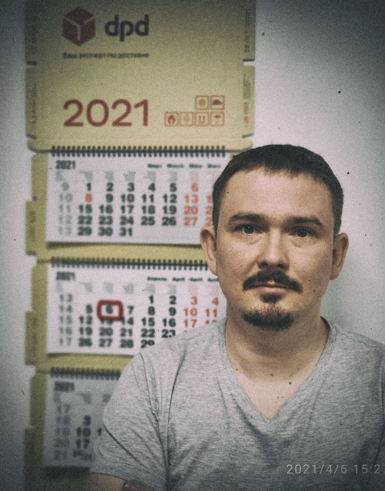

# Дементьев Алексей Алексеевич
_____
## Немного обо мне
 
Я работаю Веб-разработчиком в крупной международной компании. Моя специализация PHP-разработчик. Решил переучится на JAVA, как на более сложный и универсальный, а также востребованный язык разработки. C 25 февраля 2022 года временно проживаю на территории Турции. 

## Мои навыки:
* BACKEND Разработка веб-приложений на PHP, Java
* FRONTEND: html, css, javascript, jquery
* DB: работы с базами данных MySQL, PostgreSQL, Mongo

